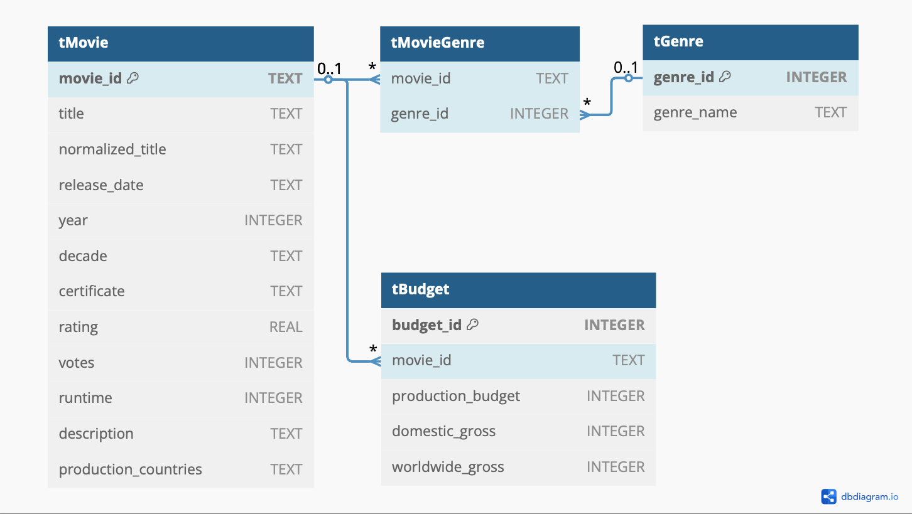

# **MOVIZ Visualization Tool – *Welcome to MoVIZ 🎞* **

*MOVIZ* enable users to visualize movie statistics ranging from budget indie projects to record-breaking blockbusters, from the earliest films to newest releases.
The project implements a full data pipeline to ingest up-to-date datasets from TMDB, IMDb, and *The Numbers* budget dataset, applying normalization and various cleaning methods, and a robust database. The MoVIZ database contains a wide array of films from 1880 to 2025. Users can filter their desired characteristics, analyze, and visualize relationships between genres, decades, certificates, ratings, production budgets, and worldwide box office gross, all with a user-friend GUI. 

### Features

**Data Ingestion and Cleaning**
The pipeline handles the downloading and loading datasets from TMDB, IMDb Genres, and budget [project datasets](#Acknowledgements). Each dataset contributes various data to MoVIZ:
- TMDB dataset: comprehensive movie metadata (title, release date, ratings, etc.)
- IMDb Genres dataset: genres, equivalency id mappings, certificates
- Budget dataset: production budgets, domestic and worldwide gross earnings

This portion of the pipeline prepares data for database ingestion by ensuring consistency across datasets through data type and column normalization, handling format discrepancies and missing values.
- **Title Normalization**: lowercased all text and removed whitespace/special characters to ensure ease in merging on fallback keys
- **Year Extraction**: extracted ```year``` from various date formats in all three datasets, and enforced date range (1880-2025)
- **Certificate Mapping**: realigned movies rated under foreign criteria to the MPAA rating certificates
- **Genre Mapping**: standardized genre names
- **Duplicate Removal**: removed duplicates by ```imdb_id``` for the Genres dataset and ```movie_id``` for the TMDB dataset, then performed a fallback drop to remove duplicates on ```normalized_title``` and ```year```
- **Adult Content & Status Filtering**: excluded adult films and any non-'Released' film titles in the TMDB dataset
- **Dataset Augmentation**: added ```decade``` column for enhanced historical handling in all three datasets
- **Null Value Handling**: implemented a critical and non-critical column hierarchy and threshold (i.e. title and date would be considered critical to a film's identification, but certificate may be considered non-critical); dropped rows with null values in critical columns and implemented secondary framework to remove rows given 80% of data was missing in non-critical columns
- **Column Normalization**: standardized column names across all the datasets for ease of merging for the database step

**Relational Database Table Diagram**
- Here are the database logic tables used for MoVIZ.
<p align="center">
  
</p>

**Data Merging and Table Relationships**
- TMDB and Genres Merge: merged on ```movie_id``` and falls back to match on ```normalized_title``` + ```year```
- Budget Mapping: linked budget by ```normalized_title``` + ```year``` since the budget dataset does not initially have a ```movie_id``` column; it prioritizes the fallback matches to the TMDB dataset (since greater number of movies and potential matches) then falls back to the genres dataset
- Genre Lookup Table: generated unique genre table with ```genre_id``` and  ```genre_name```
- Movie-Genre Pivot Table: created many-to-many relationship between movies and genres (movies may have multiple genres)

**Interactive Visualization GUI**
The implementation has been built with [Dash](https://dash.plotly.com/). Users can filter characteristics and analyze trends through the MoVIZ dashboard by:
- Filtering movies by genre name, decade, certificate, rating, worldwide gross, and/or production budget
- Selecting customizable ranges and explorable values for their filters
- Exploring different types of data with dynamic plot types including scatter plots, bar charts, and stacked bar charts

### Considerations
Due to GitHub's max limit on the size of dataset files, I have opted not to push ```/processed``` and ```/raw``` files and folders; however, the framework will populate and become available upon cloning the repository and running the pipeline.
- The decision for the date ranges from ```1880-1889``` to 04/2025 is to allow for leniency and to allow for the earliest movies to be included. The basis for 1880 comes from the first motion picture created, the [*Roundhay Garden Scene*](https://en.wikipedia.org/wiki/List_of_cinematic_firsts#:~:text=1888,the%20first%20motion%20picture%20recorded.) in 1888. In style with the limiting to released movies, MOVIZ's availability has been limited to movies released during or before April 2025.
- If you would like more information on the project details, especially regarding dataset cleaning justification and related processes, the documentation write-up is available [here](DATA440_Final_Project_Write-Up_(GitHub).pdf).
  - Note: In my references, I mention an IMDb dataset and a genres dataset-- they are the same and the names are used interchangeably.

### Limitations
- While *The Numbers* provides comprehensive financial data coverage for roughly 6000 films, visualizations involving **production budgets** or **worldwide gross earnings** will naturally be limited to this subset. As a result, financial analyses may not cover the full scope of TMDB and IMDb dataset offerings.
- Some movies may be excluded from specific visualizations if they lack critical plotting variables as observations. For example:
  - A movie missing **production budget** may not appear on visualizations where **production budget** is used as a plotted axis (x or y), even if it matches filter criteria.
- This discrepancy may arise from the inherent difference in available data coverage across datasets. This is to be expected when merging sources with varying levels of detail and coverage.


## Project Support
This project was built with Python **3.12.8** and uses ([`uv`](https://docs.astral.sh/uv/getting-started/installation/)) for virtual environment and package management. MOVIZ's dependencies have been listed in `pyproject.toml`. The official documentation for the tool can be found ([here](https://docs.astral.sh/uv/)). 

To launch the application and begin visualization for the first time, clone the repository and run with ```python main.py```. The application will automatically check for existing data and prompt you to run the pipeline if needed. Once the data is ready, the dashboard will launch at `http://localhost:8050/`.


## Project Structure
```
data/
├── processed/
├── raw/
logs/
src/
├── dash/
│   ├── dashboard_testing.py	
│   └── movie_db.py
├── database/
│   └── database.py
├── downloading/
│   ├── downloading.py
│   └── webscraping.py
├── processing/
│   ├── cleaner_tools.py
│   ├── cleaning.py
│   └── merging.py
└── utils/
    ├── helpers.py
    └── logging.py
.gitattributes
.gitignore
.python-version
main.py
pyproject.toml
README.md
DATA440_Final_Project_Write-Up_(GitHub).pdf
MoVIZ_RDb.pdf
uv.lock
```

## Acknowledgements
This project is product of my love for movies and statistics. MOVIZ's data was collected from the following sources:
1. [u/asaniczka](https://github.com/asaniczka)'s ["Full TMDB Movies Dataset 2024 (1M Movies)"](https://www.kaggle.com/datasets/asaniczka/tmdb-movies-dataset-2023-930k-movies) via Kaggle
2. [u/ChidambaraRaju](https://github.com/ChidambaraRaju)'s ['IMDb Movie Dataset: All Movies by Genre'](https://www.kaggle.com/datasets/rajugc/imdb-movies-dataset-based-on-genre) via Kaggle
3. Movie Budget data from [The-Numbers.com](https://www.the-numbers.com/movie/budgets/all)
4. Thank you to https://dbdiagram.io/home, which was used to create my database table logic


## Future Improvements
- Expand available visualization features and filtering options
- Incorporate a movie recommendation system based on visualization insights
- Further optimize performance for large datasets
